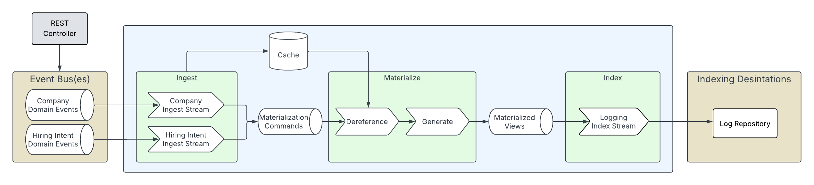

# IMI Demo
This is a demo project for Ingest-Materialize-Index stream topology/architecture, as presented at Confluent Current in New Orleans in 2025.

This application demos the following architecture:



## How to Run
This project is a runnable Spring Boot application. The following instructions show how to execute it:

### Prerequisites
The following prerequisites must be satisfied in order to run this project:

1. JDK 1.8 or higher installed
2. Docker running locally
    - In order to run some resources locally (i.e. AWS Localstack), Docker is needed

### Running the Application
You can run this application by simply executing the following:

```bash
./mvnw spring-boot:run
```

### Interacting with Application
You can use the following curl commands to illustrate the purpose of this demo:

#### Create a "Company"
```bash
curl --location 'http://localhost:8080/companyCreatedEvents' \
--header 'Content-Type: application/json' \
--data '{
    "companyId": "1",
    "companyName": "Confluent"
}'
```

#### Create a "Hiring Intent"
```bash
curl --location 'http://localhost:8080/hiringIntentCreatedEvents' \
--header 'Content-Type: application/json' \
--data '{
    "hiringIntentId": "1",
    "companyId": "1",
    "jobTitle": "Software Engineer",
    "jobDescription": "Stream all the things!"
}'
```

#### Result
You should see "views" produced (logged) that look like the following:
```json
{
  "hiringIntentId" : "1",
  "companyName" : "Confluent",
  "jobTitle" : "Software Engineer",
  "jobDescription" : "Stream all the things!"
}
```
